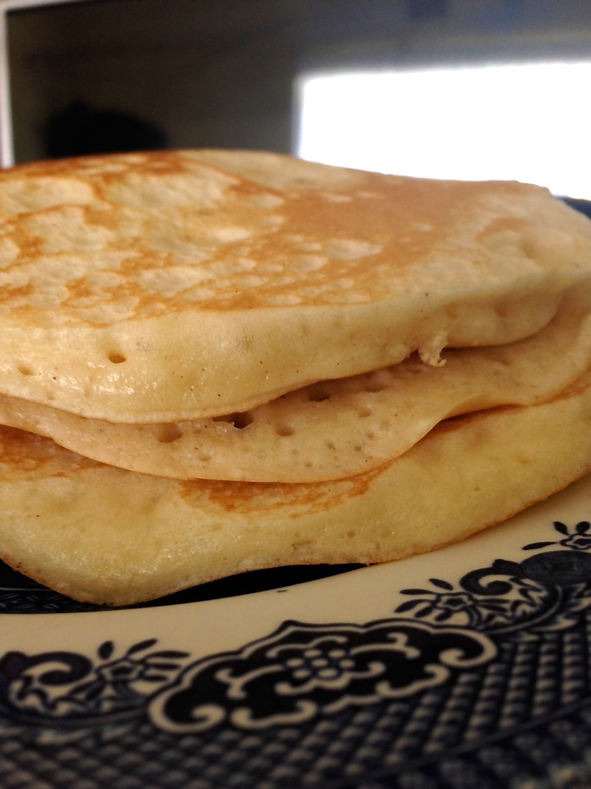
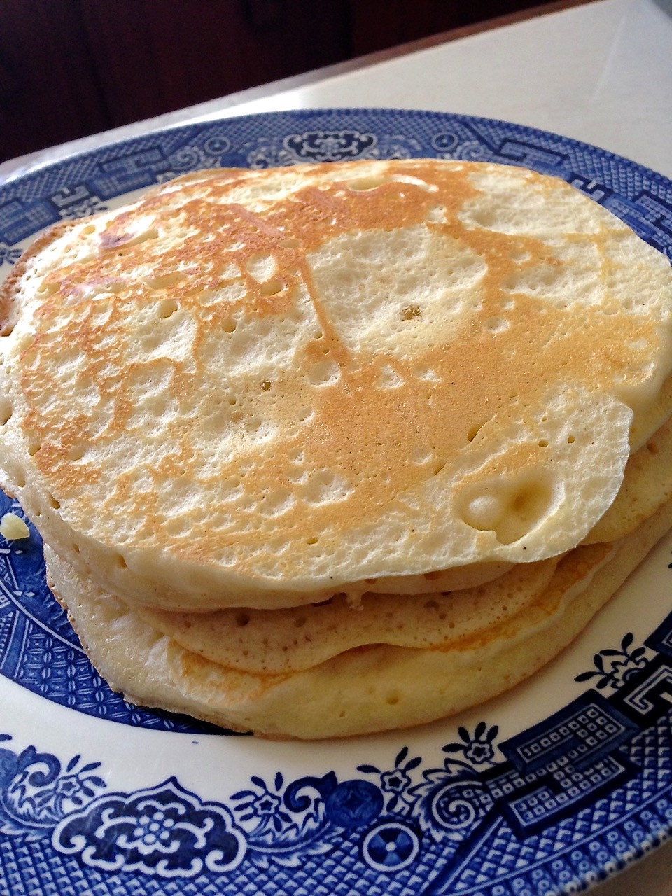

# Sunshine Pancake Recipe

Making the perfect pancakes is easy. This recipe shows how to make a batch of 18 pancakes.

##### Quick Stats

Preparation time: Less than **20 minutes**

Cooking time: About **15 - 20 minutes**

Servings: Makes **approximately 15 - 18** pancakes

Enjoy!!

## Recipe

The hardest part about this recipe is waiting for the pancakes to be done :)

### Ingredients

- 4 cups flour
- 2 cups milk
- 1 cup brown sugar
- 1/2 cup oil (or melted margarine)
- 6 tsp baking powder
- 1 tsp lime juice (this gets rid of the 'eggy' smell)
- 1 tsp vanilla
- 1/2 tsp salt
- 1/4 tsp nutmeg
- 1/8 tsp cinnamon (this is optional - but I like it)
- 2 eggs

### Preparations

1. Combine all of the **dry ingredients** in a large bowl, ensuring that they are thoroughly mixed.
2. Add the rest of the ingredients, and mix for about **3 - 5 minutes**.
3. Let the batter sit for about **15 minutes**. This step gives the baking powder some time to work, resulting in really fluffy and light pancakes.

### Cooking instructions

**Note:** Do not add a lot of oil to the pan. It's not needed as you already added oil to the batter.

**Tip:** Each pancake takes about a minute to be cooked.

1. Use a medium flame.
2. Brush on a really **small** amount of oil onto a non-stick frying pan. If you don't have a cooking brush, coat the bottom of the frying pan with about **1 tsp** of cooking oil.
3. Once the pan is hot, pour about **1/2 cup** of batter into the pan.
4. Flip the batter once you start seeing **large bubbles** forming. This is what [it should look like](assets/sunshine-pancake-recipe/time-to-flip.JPG) when it's ready to be flipped.
5. Fry the other side for about **20 - 24 seconds**.
6. Brush on more oil after every third or fourth pancake.

**Tip**: Here's how I [flip](assets/sunshine-pancake-recipe/flipping.MOV) the pancakes.

The timing may vary, so give it a few tries until you get it right.

Enjoy!!

Share your results with me on twitter: [@haroldcampbell](http://twitter.com/haroldcampbell)
